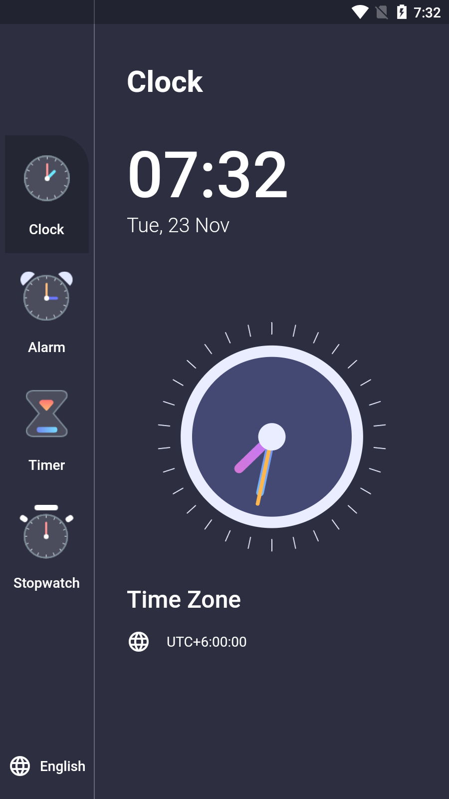
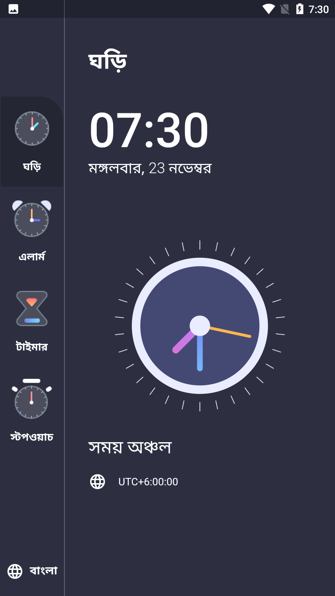
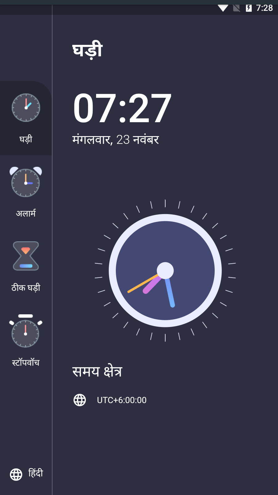
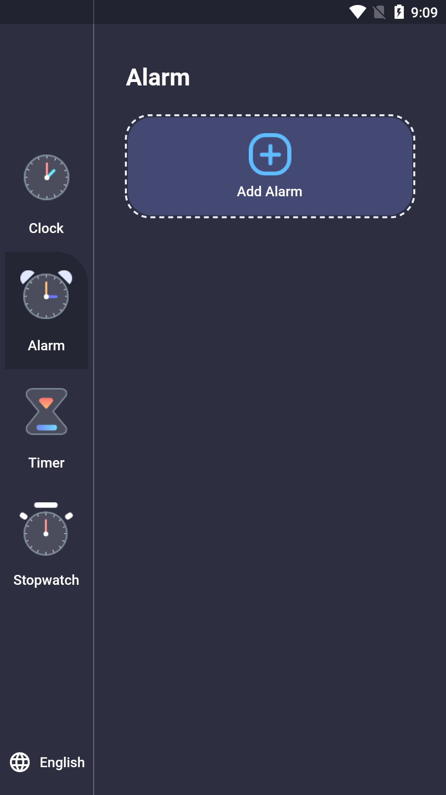

# Flutter Clock Application
--------------------------------------------------------- 
Time is the most valuable thing a person can spend. 
--------------------------------------------------------- 
 
In this awesome project I did all the heavy works like: 
1. Use of BLoC for State Management 
2. Use of Flutter Local Notification 
3. Use of Internationalization or Localization 
4. Use of Local Database (SQflite Package) 
5. Use of Flutter CustomPainter (Canvas) 

Here is the Clock Page View: 
 
 
Output screens of each supported language:
Clock page (Bangla)        |  Clock page (English)     |  Clock page (Hindi)
:-------------------------:|:-------------------------:|:-------------------------:
  |    |  
 
To draw the clock, I used Flutter CustomPainter Class. 
In the bottom left corner, We can change the language of the application. 
Now, Only Bangla, English and Hindi languages are available. 
We can switch to the other views by using the left side menu options. 
Here I have implemented the BLoC State Management to control these events. 
 
Here is the Alarm Page View: 
 
To store all the alarms I used Flutter Local Database Library (SQflite). 
And for the notification, I used Flutter Local Notification Library. 
Till Now, These are the features I am working with. 
InShaaAllah, I will finish this project very soon. 
Thanks for your time. 
😀😀😀
